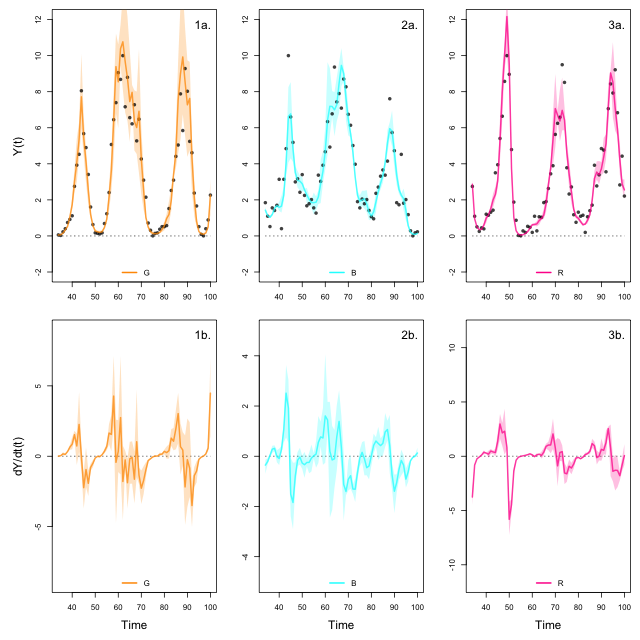
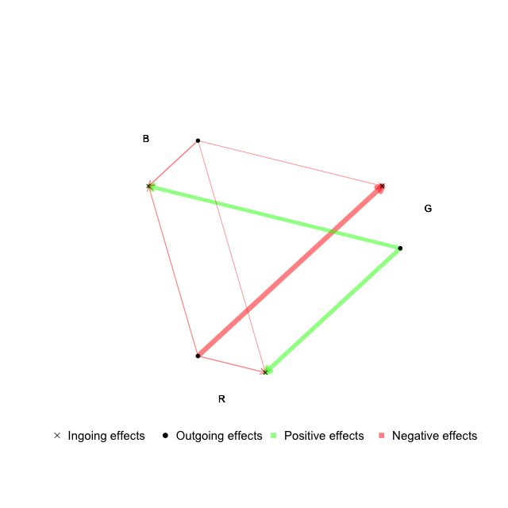

# NODEBNGM RStudio

Author: Willem Bonnaffé


---------------------
## Aim

The aim is to estimate the effects and contributions of each species to the dynamics of other species in a system.

The time series are analysed by NODEBNGM, that is fitting neural ordinary differential equations (NODEs) via Bayesian neural gradient matching (BNGM), which provides interpolations of the state and dynamics of the species, as well as nonparametric estimates of the per-capita growth rates of the species as a function of species density. 
By computing the sensitivity of the per-capita growth rates with respect to each species density, we can derive effects and contributions of species to the dynamics of other species.


---------------------
## Inputs

### Data

The first user input is the time series data, formatted as a csv file, which contains abundance estimates of the species (e.g. counts, densities) and environmental variables (e.g. sea-bottom temperature).

### Parameters of the observation process model

The second user input is the parameters of the observation model (i.e. the neural networks that interpolates the time series) and process model (the NODEs that approximate the per-capita growth rate based on the interpolated variables).
See below for instructions on how to specify the parameters and run the code.


---------------------
## Outputs

### Interpolated time series and dynamics

The observation model provides interpolations of the state variables and their dynamics. 
The interpolations are obtained by fitting a single layer neural network with sinusoidal activation functions to the time series.
The interpolated dynamics are obtained by deriving the interpolation of the state variables with respect to time.

### Effects and contributions of variables to the dynamics of other variables

The process model provides nonparametric approximations of the per-capita growth rate of the variables as a function of all variables in the system.
The effects of a variable on another can be computed by calculating the sensitivity of the per-capita growth rate with respect to a change in the variables.
Contributions are then obtained by multiplying the dynamics of the effector variable with its effect on the affected variable.

### Dynamical interaction networks

Relative total contributions are obtained by summing the square of contributions of variables across the entire time series and normalising them by the total contributions (of all variables together).
These, together with the mean effect of a variable can be used to build dynamical interaction networks, which show the effect and contributions of variables to the dynamics of other variables.


---------------------
## Initialisation

The approach can be used simply by installing R (v4.0.2 or later) and loading the NODEBNGM function library

``` R
## load NODEBNGM functions
source("f_NODEBNGM.r")

## make output directory
pathToOut = "out"
system(paste("mkdir",pathToOut))
```


---------------------
## Preparing the data

The first step is to load and format the time series dataset.

``` R
## load data
TS = read.table("data/TS_AFR2.csv",sep=";",header=T)

## extract time steps and columns of interest
selected_time_steps = 1:nrow(TS)
selected_columns  = c("t", "G", "B", "R")
TS = TS[selected_time_steps, selected_columns]

## normalise time series
normalise = function(x) (x-min(x))/(max(x)-min(x)) * 10
TS[,-1] = apply(TS[,-1], 2, normalise)

## set 0s to small value to avoid NAs
for(i in 2:ncol(TS)) TS[,i][which(TS[,i] < 0.005)] = 0.005

## visualise time series
plotTimeSeries(TS)
```

<p align="center">

</p>


---------------------
## Fitting observation model

Fitting the observation model corresponds in interpolating the variables in the time series to get an approximation of the states and dynamics of each variable.

``` R
## parameters of observation model
N       = ncol(TS) - 1       # number of variables
K_o     = 3                  # number of ensemble elements
W_o     = rep(30, N)         # number of neurons in observation model (i.e. single layer perceptron)
N_o     = W_o * 3            # total number of parameters in observation model
rho     = 1                  # proportion of best samples to reject (to refine quality of fit if necessary)
alpha_i = 1                  # upsampling interpolation factor (2 doubles the number of points in interpolated time series)

## train observation model
runtime_o = system.time({
    model_o = trainModel_o(TS, alpha_i, N_o, K_o, rho)
})[3]
Yhat_o      = model_o$Yhat_o
ddt.Yhat_o  = model_o$ddt.Yhat_o
Omega_o     = model_o$Omega_o

## visualise observation model fit
plotModel_o(TS, alpha_i, Yhat_o, ddt.Yhat_o)
```

<p align="center">

</p>


---------------------
## Fitting process model

Fit process model (i.e. explain the per-capita growth rate of the populations calculated as $1/Y*dY/dt$ as a function of the states Y(t))

```R
## parameters of process model
K_p   = 3                      # number of models to fit
W_p   = rep(10, N)             # number of neurons in single layer perceptron (SLP)
N_p   = 2 * W_p * (2+N)        # number of parameters in process model
sd1_p = 0.1                    # standard deviation of model likelihood
sd2_p = as.list(rep(0.1,N))    # standard deviation of prior distributions
         
## train process model
runtime_p = system.time({
    model_p = trainModel_p(Yhat_o, ddt.Yhat_o, N_p, sd1_p, sd2_p, K_p, trainSplit=2/3)
})[3]
Yhat_p     = model_p$Yhat_p     
ddx.Yhat_p = model_p$ddx.Yhat_p 
Geber_p    = model_p$Geber_p   
Omega_p    = model_p$Omega_p   

## visualise process model
plotModel_p(TS, alpha_i, Yhat_p, ddx.Yhat_p, Geber_p)
```

<p align="center">

</p>


---------------------
## Computing effects and contributions

This section describes how to run the code to obtain effects and contributions from the results obtained from the observation and process model.

```R
## compute effects and contribution matrix
MSq = function(x) mean(x^2)
prop = function(x) x/sum(x)
J = t(matrix(unlist(lapply(ddx.Yhat_p,function(x)apply(matrix(apply(x,2,mean),nrow=nrow(TS),byrow=T),2,mean))),ncol=ncol(TS)-1)) ## average across samples then average across time steps
C = t(matrix(unlist(lapply(Geber_p,   function(x)apply(matrix(apply(x,2,mean),nrow=nrow(TS),byrow=T),2,MSq))),ncol=ncol(TS)-1)) ## average across samples then take mean square across time steps
C = t(apply(C,1,prop))

## thresholding out weak interactions
J = J*(C>0.1)
C = C*(C>0.1)

## dynamical interaction plot (v1)
plotDIN(J, C, colnames(TS)[-1])
```

<p align="center">

</p>


---------------------
## Cross-validation

We can find the best value for the regularisation parameter by cross-validation.

``` R
## parameters for cross-validation
K_p             = 1                            # number of models to fit per folds and regularisation parameter
max_fold        = 2/3                          # beginning of test set
folds           = list(c(0,1/2) * max_fold, 
                       c(1/2,1) * max_fold)    # proportion of the data in each fold
crossValParVect = seq(0.005,0.05,0.005)        # vector of values of the regularisation parameter

## run cross-validation
resultsCrossVal_p = crossVal_p(TS, alpha_i, Yhat_o, ddt.Yhat_o, N_p, sd1_p, sd2_p, K_p, folds, crossValParVect)

## visualise
plotCrossVal_p(resultsCrossVal_p)
```


-----------------
## Files description 

### Main files: 
* `f_NODEBNGM.r` contains all the functions necessary to running the scripts
* `m_main.r` contains the commands to fit NODEs by BNGM

### Data:
* `data` contains the time series data as csv files
* `data/TS_AFR1-3.csv` contains experimentally replicated time series of a system with an algae, flagellate, and rotifer (Hiltunen et al. 2013)
* `data/TS_HL.csv` contains the hare-lynx pelt count time series (Bonnaffe et al. 2021)
* `data/TS_RPS.csv` contains a rock-paper-scissor time series generated with NetLogo (https://ccl.northwestern.edu/netlogo/)
* `data/TS_Ushio` contains time series of the 15 dominant species of the Maizuru bay community (Ushio et al. 2018)

### Output files:
* `out` contains the output of the scripts 
* `out_repeat` contains repeat results of the analysis to assess repeatability of the results 
* `out/crossVal_p.RData` contains the likelihood of the predictions of the model for each value of the regularisation hyperparameter
* `out/ddt.Yhat_o.RData` contains the interpolated dynamics of the state variables 
* `out/ddx.Yhat_p.RData` contains the sensitivity of the per-capita growth rate of variables with respect to the each state variable
* `out/fig_crossVal_p.pdf` displays the cross validation results 
* `out/fig_DIN.pdf` displays the dynamical interaction graph
* `out/fig_predictions_o.pdf` displays results of the observation model, i.e. the interpolation of states and dynamics of each variable
* `out/fig_predictions_p.pdf` displays results of the process model, i.e. the effects and contribution of each variable to the dynamics of the system 
* `out/fig_time_series.pdf` displays time series of the variables
* `out/Geber_p.RData` contains the contributions of each variable to the dynamics of the system 
* `out/Omega_o.RData` contains the ensemble of parameters of the observation model 
* `out/Omega_p.RData` contains the ensemble of parameters of the process model
* `out/runtime_o.txt` contains the runtime in seconds of fitting the observation model
* `out/runtime_p.txt` contains the runtime in seconds of fitting the process model
* `out/Yhat_o.RData` contains the interpolated state variables 
* `out/Yhat_p.RData` contains the interpolated per-capita growth rate of each state variable


---------------
## References

Bonnaffé, W., Sheldon, B.C. and Coulson, T., 2021. Neural ordinary differential equations for ecological and evolutionary time‐series analysis. Methods in Ecology and Evolution, 12(7), pp.1301-1315.

Hiltunen, T., Jones, L.E., Ellner, S.P. and Hairston Jr, N.G., 2013. Temporal dynamics of a simple community with intraguild predation: an experimental test. Ecology, 94(4), pp.773-779.

Ushio, M., Hsieh, C.H., Masuda, R., Deyle, E.R., Ye, H., Chang, C.W., Sugihara, G. and Kondoh, M., 2018. Fluctuating interaction network and time-varying stability of a natural fish community. Nature, 554(7692), pp.360-363.

