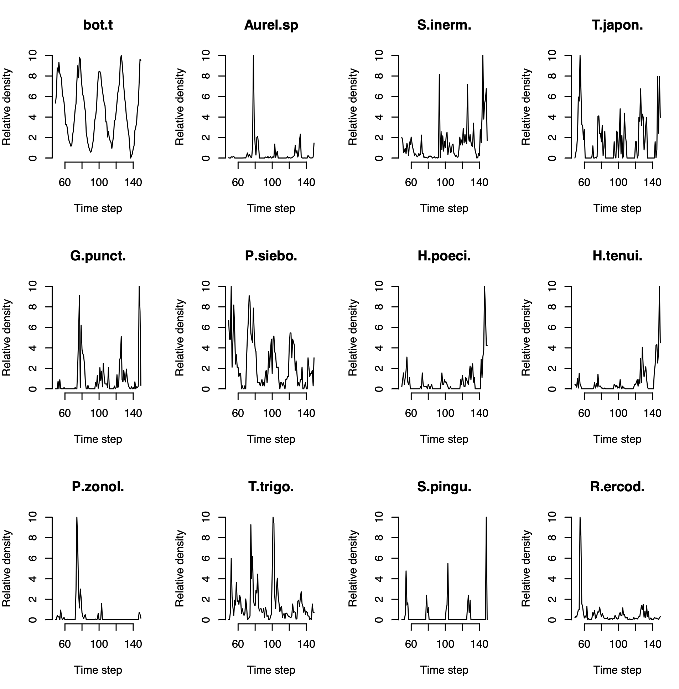
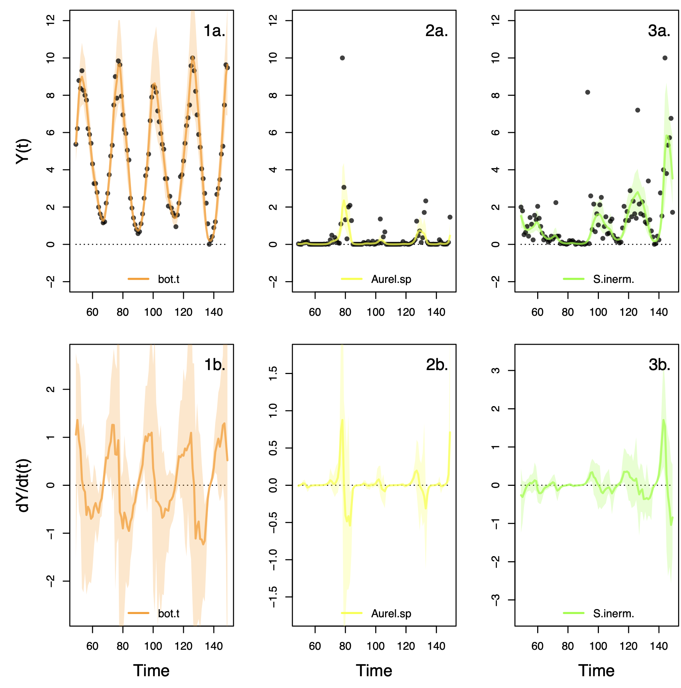
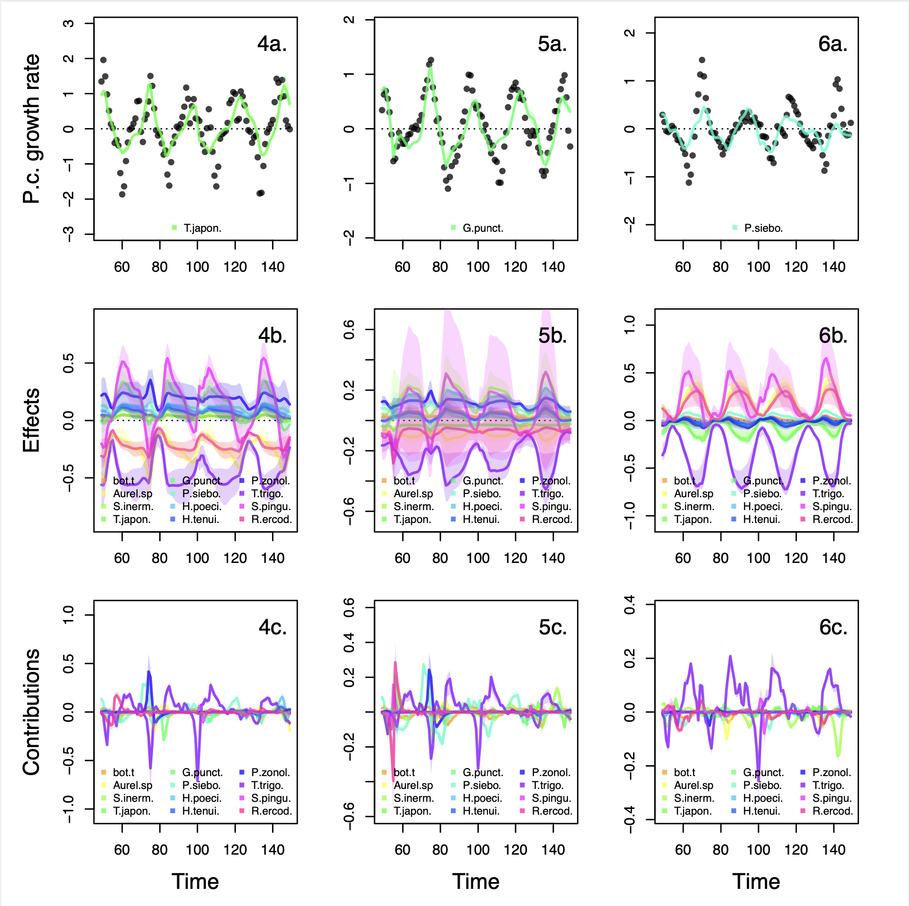
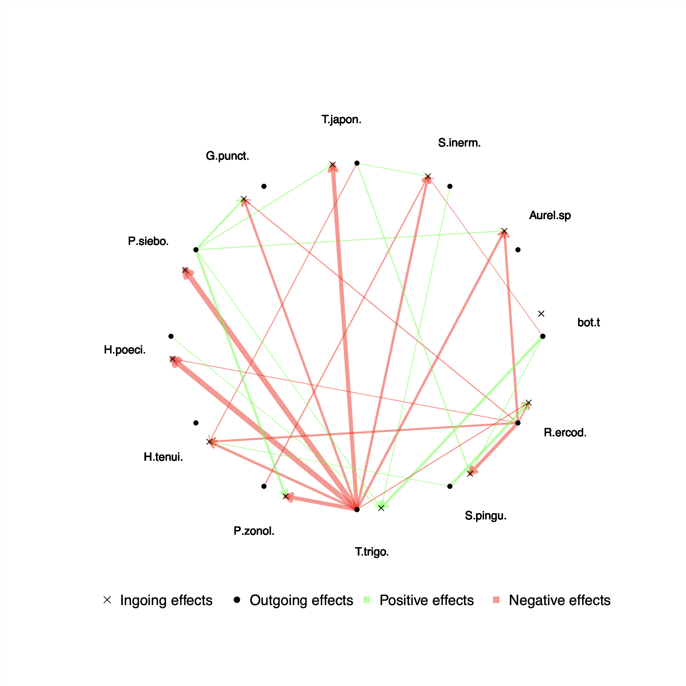

# NODEBNGM analysis of Ushio system


--------------
## Aim

The aim of this analysis is to estimate the effects and contributions of each species to the dynamics of the populations in the Maizuru bay community (Ushio et al. 2018).
The system consists in 12 years long time series of fortnight abundance estimates of 15 of dominant species of the aquatic community of the Maizuru bay in Japan.
The time series are analysed by fitting neural ordinary differential equations (NODE) via Bayesian neural gradient matching (BNGM), which provide interpolations of the state and dynamics of the species, as well as nonparametric estimates of the per-capita growth rates of the species as a function of species density. 
By computing the sensitivity of the per-capita growth rates with respect to each species density, we were able to derive effects and contributions to the dynamics of the species on each other.

Ushio, M., Hsieh, C.H., Masuda, R., Deyle, E.R., Ye, H., Chang, C.W., Sugihara, G. and Kondoh, M., 2018. Fluctuating interaction network and time-varying stability of a natural fish community. Nature, 554(7692), pp.360-363.


--------------
## Inputs

### Data

The first input is the time series data, formatted as a csv file, which contains abundance estimates of the species (counts) and environmental variables (sea-bottom temperature in degrees celsius here).
All variables need to be strictly positive.

### Parameters of the observation process model

The second input is the parameters of the observation model (i.e. the neural networks that interpolates the time series) and process model (the NODEs that approximate the per-capita growth rate based on the interpolated variables).
See below for instructions on how to specify the parameters and run the code.


--------------
## Outputs

### Interpolated time series and dynamics

The observation model provides interpolations of the state variables and their dynamics. 
The interpolations are obtained by fitting a single layer neural network with sinusoidal activation functions to the time series.
The interpolated dynamics are obtained by deriving the interpolation of the state variables with respect to time.

### Effects and contributions of variables to the dynamics of other variables

The process model provides nonparametric approximations of the per-capita growth rate of the variables with respect to all variables in the system.
The effects of a variable on another can be computed by calculating the sensitivity of the per-capita growth rate with respect to a change in the variables.
Contributions are then obtained by multiplying the dynamics of the effector variable with its effect on the affected variable.

### Dynamical interaction networks

Relative total contributions are obtained by summing the square of contributions of variables across the entire time series and normalising them by the total contributions (of all variables together).
These, together with the mean effect of a variable can be used to build dynamical interaction networks, which show the effect and contributions of variables to the dynamics of other variables.


--------------
## Installation

The approach can be used simply by installing R (v4.0.2 or later) and loading the NODEBNGM function library

``` R
source("f_NODE_GM_Rstudio.r")
```


--------------
## Preparing the data

### Loading data

``` R
TS = read.table("data/TS.csv",sep=",",header=T)
```

### Select variables of interest

``` R
selected_time_steps = 50:150
selected_columns  = c(
  "time_step",
  # "surf.t",
  "bot.t",
  "Aurelia.sp",
  # "Engraulis.japonicus", #
  # "Plotosus.lineatus", #
  "Sebastes.inermis",
  "Trachurus.japonicus",
  "Girella.punctata",
  "Pseudolabrus.sieboldi",
  "Halichoeres.poecilopterus",
  "Halichoeres.tenuispinnis",
  # "Chaenogobius.gulosus", #
  "Pterogobius.zonoleucus",
  "Tridentiger.trigonocephalus",
  # "Siganus.fuscescens", #
  "Sphyraena.pinguis", #
  "Rudarius.ercodes"           
)
TS = TS[selected_time_steps,]
TS = TS[,selected_columns]
```

### Format column names

```R
column_names =  c("time_step",
                    "bot.t",
                    "Aurel.sp",
                    "S.inerm.",
                    "T.japon.",
                    "G.punct.",
                    "P.siebo.",
                    "H.poeci.",
                    "H.tenui.",
                    "P.zonol.",
                    "T.trigo.",
                    "S.pingu.",
                    "R.ercod."
                  )
colnames(TS) = column_names
```

### Normalising time series

``` R
TS[,-1] = apply(TS[,-1],2,function(x)(x-min(x))/(max(x)-min(x))*10) # normalise time series
for(i in 2:ncol(TS)){TS[,i][which(TS[,i]<0.005)] = 0.005} # set 0s to small value to avoid NAs
```

### Visualise the formatted time series

``` R
par(mfrow=c(3,4))
for(i in 2:ncol(TS))
{
  plot(TS[,1],TS[,i],type="l",xlab="Time step",ylab="Relative density",bty="n",main=colnames(TS)[i])
}
par(mfrow=c(1,1))
```

<p align="center">

</p>

### Create the output folder

``` R
pathToOut = "out"
system(paste("mkdir",pathToOut))
```


--------------
## Fitting observation model

Fitting the observation model corresponds in interpolating the variables in the time series to get an approximation of the states and dynamics of each variable.

### Parameters of the observation model

``` R
N       = ncol(TS) - 1
K_o     = 3                  # number of ensemble elements
W_o     = rep(30,N)          # number of neurons in observation model, by default a single layer perceptron (equivalent to number of elements in Fourier series)
N_o     = W_o*3              # total number of parameters in observation model
rho     = 1                  # proportion of best samples to reject (to refine quality of fit if necessary)
alpha_i = 1                  # upsampling interpolation factor (2 double the number of points in interpolated time series)
```

### Training of the observation model

``` R
model_o     = trainModel_o(TS,alpha_i,N_o,K_o,rho)
Yhat_o      = model_o$Yhat_o
ddt.Yhat_o  = model_o$ddt.Yhat_o
Omega_o     = model_o$Omega_o
```

### Visualising the fit

``` R
plotModel_o(TS,alpha_i,Yhat_o,ddt.Yhat_o)
```

<p align="center">

</p>

### Storing the results

``` R
save(Yhat_o,    file=paste(pathToOut,"/","Yhat_o.RData"    ,sep=""))
save(ddt.Yhat_o,file=paste(pathToOut,"/","ddt.Yhat_o.RData",sep=""))
save(Omega_o,   file=paste(pathToOut,"/","Omega_o.RData"   ,sep=""))
```


--------------
## Fitting process model

Fit process model (i.e. explain the per-capita growth rate of the populations calculated as $1/Y*dY/dt$ as a function of the states Y(t))

### Load observation model results (optional)

``` R
load(file=paste(pathToOut,"/","Yhat_o.RData"    ,sep=""))
load(file=paste(pathToOut,"/","ddt.Yhat_o.RData",sep=""))
load(file=paste(pathToOut,"/","Omega_o.RData"   ,sep=""))
```

### Parameters of process model

```R
K_p   = 3                      # number of models to fit
W_p   = rep(10,N)              # number of neurons in single layer perceptron (SLP)
N_p   = 2 * W_p * (2+N)        # number of parameters in process model
sd1_p = 0.1                    # standard deviation of model likelihood
sd2_p = as.list(rep(0.03, N))  # standard deviation of prior distributions (second half concerns nonlinear functions)
             
```

### Train process model

```R
model_p    = trainModel_p(Yhat_o,ddt.Yhat_o,N_p,sd1_p,sd2_p,K_p)
Yhat_p     = model_p$Yhat_p     
ddx.Yhat_p = model_p$ddx.Yhat_p 
Geber_p    = model_p$Geber_p   
Omega_p    = model_p$Omega_p   
```

### Visualise process model

```R
plotModel_p(TS,alpha_i,Yhat_p,ddx.Yhat_p,Geber_p)
```

<p align="center">

</p>

### Store results 

```R
save(Yhat_p       ,file=paste(pathToOut,"/","Yhat_p.RData"    ,sep=""))
save(ddx.Yhat_p   ,file=paste(pathToOut,"/","ddx.Yhat_p.RData",sep=""))
save(Geber_p      ,file=paste(pathToOut,"/","Geber_p.RData"   ,sep=""))
save(Omega_p      ,file=paste(pathToOut,"/","Omega_p.RData"   ,sep=""))
```


--------------
## Analysing results

This section describes how to run the code to obtain effects and contributions from the results obtained from the observation and process model.

### Load process model results

``` R
load(paste(pathToOut,"/","Yhat_p.RData"    ,sep=""))
load(paste(pathToOut,"/","ddx.Yhat_p.RData",sep=""))
load(paste(pathToOut,"/","Geber_p.RData"   ,sep=""))
load(paste(pathToOut,"/","Omega_p.RData"   ,sep=""))
```

### Compute Jacobian matrix

```R
MSq = function(x) mean(x^2)
prop = function(x) x/sum(x)
J = t(matrix(unlist(lapply(ddx.Yhat_p,function(x)apply(matrix(apply(x,2,mean),nrow=nrow(TS),byrow=T),2,mean))),ncol=ncol(TS)-1)) ## average across samples then average across time steps
C = t(matrix(unlist(lapply(Geber_p,   function(x)apply(matrix(apply(x,2,mean),nrow=nrow(TS),byrow=T),2,MSq))),ncol=ncol(TS)-1)) ## average across samples then take mean square across time steps
C = t(apply(C,1,prop))
```

### Formatting the Jacobian matrix

``` R
J[1,] = 0 # remove effects on bot
C[1,] = 0

J = J*(C>0.1) # set contributions that are <10% to 0 for visualisation
C = C*(C>0.1)
```

### Visualise the dynamical interaction plot

``` R
.plot.DIN(J,C,colnames(TS)[-1])
```

<p align="center">

</p>


--------------
## Files description 

### Main files: 
* `f_NODE_GM_RStudio.r` contains all the functions necessary to running the scripts
* `m0_main_RStudio.r` contains the commands to run the scripts in the right order to fit NODEs by BNGM 

### Data:
* `data` contains the time series data as csv files
* `data/TS.csv` contains the time series of aquatic species community of the Maizuru bay in Japan

### Output files:
* `out` contains the output of the scripts 
* `out_repeat` contains repeat results of the analysis to assess repeatability of the results 
* `out/crossVal_p.RData` contains the likelihood of the predictions of the model for each value of the regularisation hyperparameter
* `out/ddt.Yhat_o.RData` contains the interpolated dynamics of the state variables 
* `out/ddx.Yhat_p.RData` contains the sensitivity of the per-capita growth rate of variables with respect to the each state variable
* `out/fig_crossVal_p.pdf` displays the cross validation results 
* `out/fig_DIN_v1.pdf` displays the dynamical interaction graph (version 1)
* `out/fig_DIN_v1.pdf` displays the dynamical interaction graph (version 2)
* `out/fig_predictions_o.pdf` displays results of the observation model, i.e. the interpolation of states and dynamics of each variable
* `out/fig_predictions_p.pdf` displays results of the process model, i.e. the effects and contribution of each variable to the dynamics of the system 
* `out/fig_time_series.pdf` displays time series of the variables
* `out/Geber_p.RData` contains the contributions of each variable to the dynamics of the system 
* `out/Omega_o.RData` contains the ensemble of parameters of the observation model 
* `out/Omega_p.RData` contains the ensemble of parameters of the process model
* `out/Yhat_o.RData` contains the interpolated state variables 
* `out/Yhat_p.RData` contains the interpolated per-capita growth rate of each state variable
